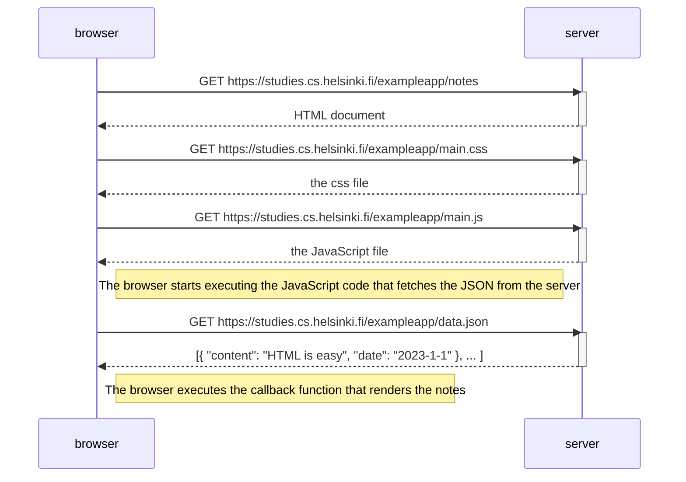
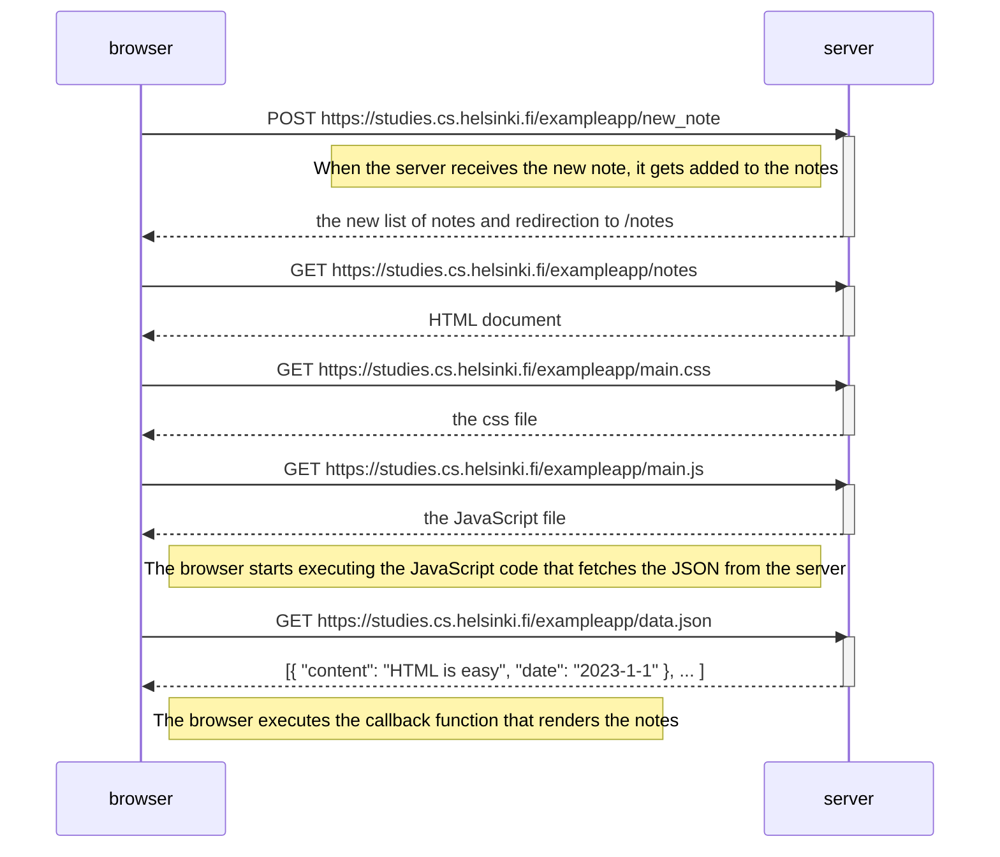

# Exercises

## 0.1: HTML
No exercises here

## 0.2: CSS
No exercises here

## 0.3: HTML forms
No exercises here

## 0.4: New note diagram
### Original Sequence Diagram

### Updated Sequence Diagram

## 0.5: 